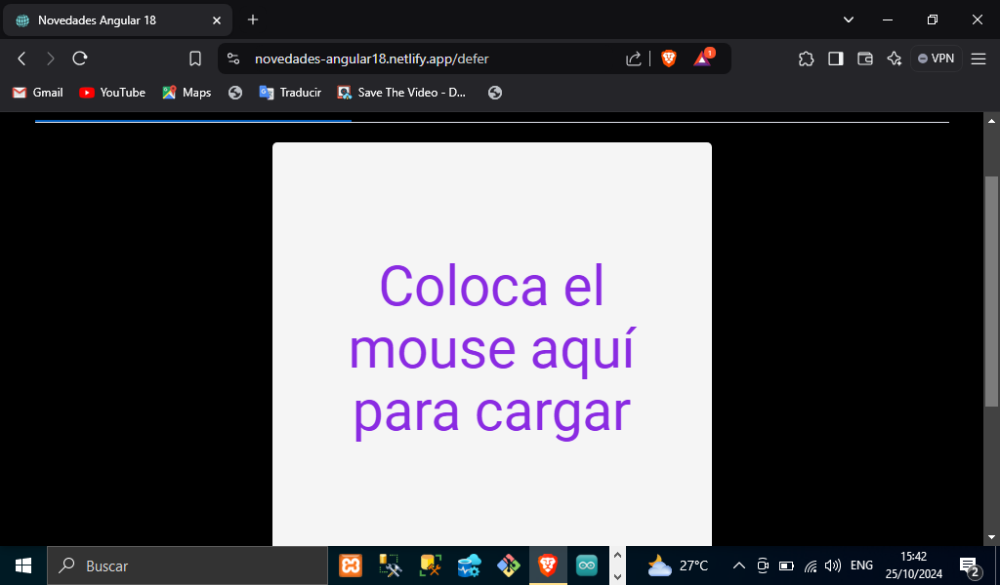
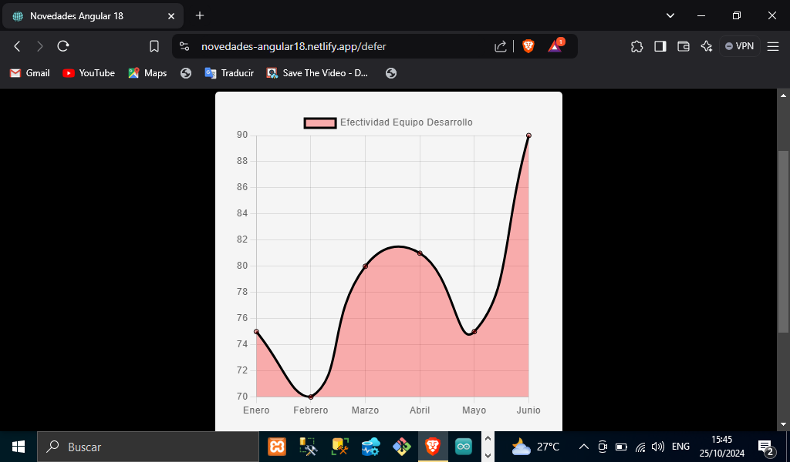

# TITULO DEL PROYECTO    

**Aplicación Web Novedades Angular 18**

# DESCRIPCIÓN DEL PROYECTO (Landing Page De Todas Las Novedades De Angular18)
**Proyecto web donde podrás conocer todas las novedades en la versión de Angular 18 se trata de una página web donde se aplicaron todas las novedades que lanzo el framework, más adelante se explicaran a detalle cada una, viene una barra de navegación donde podrás consultar cada una de estas novedades que se aplicaron  además vienen los apartados definidos por su nombre cada uno y en la pantalla un pequeño ejemplo de cómo funciona como se explica a continuación:**

## SECCION NOVEDADES ANGULAR-18 (HOME)
**En esta sección de home se implementó en forma de diapositivas todo lo relacionado con las novedades de Angular 18 así como la fecha de lanzamiento y una pequeña introducción de lo que Angular trae en su más reciente versión. Link de la página:[Novedades Angular18](https://novedades-angular18.netlify.app/)**

## VISTA PREVIA DEL HOME DE NUESTRA PAGINA
 
 

## SECCION DE SIGNALS (INPUTS) 
**Una de las novedades que trae Angular recientemente son el uso de los signal en esta sección hablaremos de los Signal Inputs que usan para enlazar los datos a través del componente padre como se hacía con los @Inputs la diferencia es que el de signal pueden cambiar en el ciclo de vida del componente, en el ejemplo tenemos una card donde pasamos los datos a través del componente padre que es nuestro archivo input.component.ts o .html donde pasamos al componente hijo el nombre, la edad y el botón de deshabilitado como se muestra en nuestro código de nuestro archivo antes mencionado de nuestro repositorio, en el apartado del home de las diapositivas viene un ejemplo en código más detallado.[Diapositivas De Angular](https://novedades-angular18.netlify.app/)**

## VISTA PREVIA DE NUESTRA EJEMPLO CON SIGNAL INPUTS(TARJETA DE PRESENTACION)


## SECCION SIGNAL(OUTPUT)
**También en las novedades de Angular 18 tenemos los signal Outputs que permiten emitir los valores de componentes a componentes padre, en el ejemplo tenemos como un contador que nos sumando 1 unidad, tenemos tres botones para sumar, restablecer los valores a cero y un botón para ocultar las unidades que se van sumando. Puedes ver el código en nuestro componente creado en el apartado de signal(output) como se implementó mas a detalle en código y además en el home de las diapositivas puedes checar un ejemplo en código también el uso de los signal output.[Novedade-Angular-18](https://novedades-angular18.netlify.app/)**

## VISTA PREVIA DEl EJEMPLO CON SIGNAL INPUTS(CONTADOR)


## SECCION SIGNAL (QUERIES)
**Otra novedad de Angular son los signal Queries que usan para buscar elementos hijos y leer el valor de sus inyectores, en el ejemplo tenemos tres textos que haciendo uso del signal query y viewChild, viewChild.required viewChildren y ngAfterViewInit podemos cambiar el valor a los texto puedes checar el código del repositorio en el apartado de Signal en queries para ver el código mas a detalle o en home de las diapositivas viene un otro ejemplo del uso de las propiedades de los Signal Queries.[Diapositivas y Ejemplos Mencionados](https://novedades-angular18.netlify.app/)**

## SECCION SIGNAL (MODEL INPUT)
**En esta novedad de model inputs se hizo para tener conexiones bidireccionales de componentes padre con componentes hijos a través de una señal ya que antes no era posible, en nuestro ejemplo tenemos como pedimos cambiar el valor a un check box de true a false y al mismo tiempo cambiar el color de verde a rojo o de rojo a verde. Puedes checar la página de los ejemplos en el siguiente enlace:[Ejemplo ModelInput](https://novedades-angular18.netlify.app/)**

## SECCCION NG-CONTENT-ACTULALIZADO
**En esta novedad de Angular 18 tenemos lo que es el ng-content actualizado esta directiva era para poder insertar contenido dentro de un componente desde afuera del mismo. Ahora podemos tener un contenido por defecto ya que en las versiones anteriores no era posible. Puedes checar el código en repositorio dentro de la carpeta app/pages/content para ver el código mas a detalle o también el ejemplo de la diapositivas de la página.[Enlace de las diapositivas](https://novedades-angular18.netlify.app/)**

## SECCION OPTIMIZED IMAGE
**Otra de las novedades que trae Angular es la optimización de imágenes es para que el usuario tenga una mayor experiencia cuando entra a nuestro sitio web ya que cuando hay imágenes tardan en cargar o no se muestran con esta propiedad de Angular lo que hace con las imágenes es  darle un efecto de difuminado para que cuando estén cargadas en la página se muestren completamente ya que hay imágenes un poco grandes y hace que nuestro sitio se más lento al momento de ingresar, y con esta novedad de Angular podemos arreglar eso. Puedes checar el código de nuestro repositorio en el apartado de app/pages/optimezed-image que es donde se encuentra nuestro componente o al igual checar nuestras diapositivas de este proyecto**

## SECCION DEFER ESTABLE
**Esta novedad de Angular hade que nuestra aplicación solo cargue los recursos solo cuando se necesitan y para eso son los defer que podemos manejar dentro de nuestra estructura HTML y cargar solo los elementos cuando se necesite ya que son disparadores que se disparan cuando se cumple cierta condición como se puede ver en nuestro siguiente fragmento de código que se utilizó en el ejemplo. Código del @defer on hover:**
```HTML
    <mat-tab label="On Hover">
        <div class="container d-flex justify-content-center align-items-center fondo">
            @defer (on hover; prefetch on timer(10000)) {
            <chart />
            } @placeholder() {
            <h1>Coloca el mouse aquí para cargar</h1>
            } @loading(minimum 3000) {
            <mat-spinner></mat-spinner>
            } @error {
            <p style="color: red;">Error
            <p>
                }
        </div>
    </mat-tab>
```
*Aquí podemos ver como utilizamos el defer onHover que solo cundo el mouse se desplace por cierta área se dispare el defer utilizamos otra propiedad llamada @placeholder para colar el contenido en el área y decir que coloque el mouse, después con la propiedad @loading hacemos que aparezca el spinner y dure 3 segundo mientras se dispara lo que queremos mostrar y al final el control de error por si algo falla*

## VISTA DEL EJEMPLO @defer ON HOVER del ejemplo antes mencionado:
### Momento en que pedimos al usuario que coloque el mouse

### Momento en se muestra el contenido después del spinner cargando y muestra el contenido que en este ejemplo es una grafica


## SECCION PROPIEDADE EVENTS PARA LOS FORMULARIOS
**En esta novedad de events en los formularios es que en el manejo de sus clases como lo son FormGroup,FormControl o FormArray y nos permiten suscribirnos a los eventos del formulario por la propiedad events en el formulario puedes mirar el código mas a detalle en el código del repositorio en el apartado app/pages/forms, o en las diapositivas de la página que explican a fondo el ejemplo de esta novedad en el siguiente enlace:[Enlace de la página](https://novedades-angular18.netlify.app/)**

## SECCION REDIRECCIONAMIENTO CON FUNCIONES
**En esta novedad de Angular 18 sobre la redirección de rutas no es más que aplicar la lógica hacia donde queremos que se dirija el usuario a través una barra de navegación como en el ejemplo pero la función pota esta lógica la podemos hacer en el mismo archivo de rutas en forma de función, como se muestra en el siguiente fragmento de código.**
*Aquí podemos  ver como se implementó la nueva forma de rutas con funciones como se puede redirigir a una ruta de usuario por su id*

```TypeScript
  {
    path: 'detalle-anterior/:id', redirectTo: ({ params }) => {
      const errorHandler = inject(ErrorHandler);
      const userIdParam = params['id'];
      if (userIdParam != 3) {
        return `/detalle-usuario/${userIdParam}`;
      } else {
        errorHandler.handleError(new Error('Attempted navigation to user page without user ID.'));
        return `/not-found`;
      }
    },
  },
```
### Novedades de Angular 18  

1. Signal(Inputs,Outputs,Queries,ModelInputs)
2. Ng-Content Actualizado
3. Propiedad Events Para Los Formularios
4. Redirección De Rutas Con Funciones
5. Angular+Wiz Repetición De Eventos
6. NgOptizedImage
7. Detección De Cambios En Evolución(Eliminación Del Zone.js)
8. Partial Hydration
9. Defer Estable
10. Nueva Web Oficial
11. Angular Material 3 
12. Public/Assets

*Elaborado Por: Mario Martínez Aguilar*

